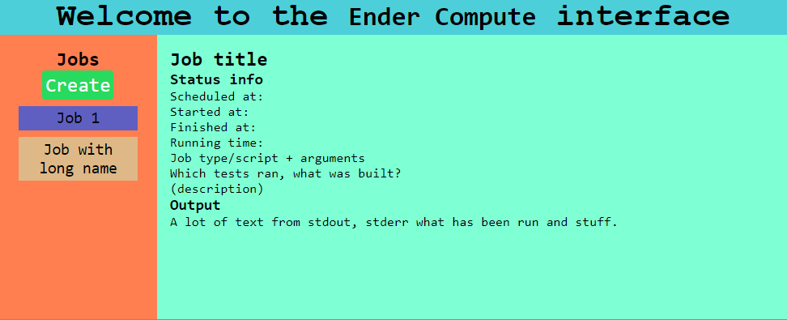

**Ender Compute** is a project about running long-running processes such as tests in the background.

Current web interface (work in progress)


It is inspired by Jenkins.

# The project
The code is written in BetterThanBatch (https://github.com/Emarioo/BetterThanBatch).

## Getting started
Download a release from github (https://github.com/Emarioo/EnderCompute/releases).
Or build it yourself.

Then run the executablein a terminal from the folder you downloaded. A web server will start
and tell you which port to connect to.

```
endercompute --port 8080
endercompute --rootdir D:/endercompute/test
```

The executable will store information that should persist in the rootdir you specify, the current directory is the default.

## Building
```
btb src/main
```

Yes, that's it. Now you know why I chose BetterThanBatch.

## Products and software
The project develops two software products.
1. A backend for managing and computing jobs.
2. A frontend UI (web server) for the backend. It allows users to create see jobs.
3. (maybe) A command line tool when you don't have a web browser (or like terminals more).

# File structure
Most directories are self explanatory (tests, examples, docs).

`public` is for web code (html, js) it is accesible by clients that connect to the web server.

`src` is code for the backend and command line tool.

# Questions
**What's up with the name?**
- **Ender** - The End in Minecraft, a void far away, can't be reached my normal means
- **Compute** - Computation, processing
- **Ender Compute** - Computation on a server endlessly running somewhere
