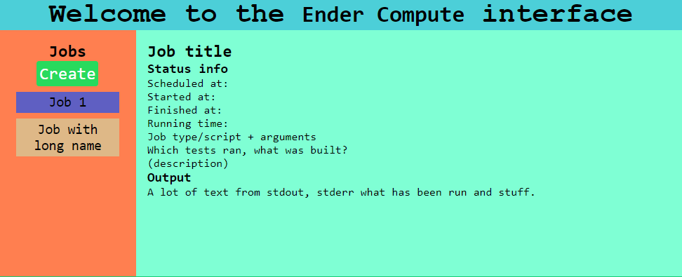

**Ender Compute** is a project about running long-running processes such as tests in the background.

Current web interface (work in progress)




# The project
The backend is written in Basin (https://github.com/Emarioo/basin).
The frontend is written in HTML, JS, and CSS.

**UNDER CONSTRUCTION:** Project was written in BTB (https://github.com/Emarioo/BetterThanBatch) and is now being rewritten in Basin.
I am rewriting because BTB is deprecated in favour of Basin. I was considering using C first but I need a project to test Basin (same reason i chose to use BTB.)

## Getting started (WIP)
Download a release from github (https://github.com/Emarioo/EnderCompute/releases).
Or build it yourself.

Then run the executablein a terminal from the folder you downloaded. A web server will start
and tell you which port to connect to.

**Flags are not up to date!**
```
endercompute --port 8080
endercompute --rootdir D:/endercompute/test
```

The executable will store information that should persist in the rootdir you specify, the current directory is the default.

## Building
```
basin src/enderc-bsn/build.bsn
```


# File structure
Most directories are self explanatory (tests, examples, docs).

`public` is for web code (html, js) it is accesible by clients that connect to the web server.

`src` is code for the backend and command line tool.

# Questions
**What's up with the name?**
- **Ender** - Refers to The End/Enderman in Minecraft. A void of scattered islands far away, can't be reached my normal means.
- **Compute** - Computation, processing.
- **Ender Compute** - Computation on some arbitrary far away server endlessly running software jobs.
